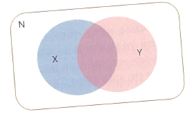
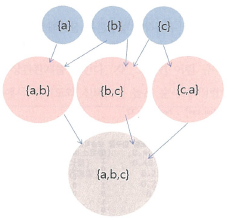

### 1. 생활 속의 문제
도시계획 관련 정책 입안: 늘 같은 건물에 있는 경향에 있는 상가 파악하기

### 2. 알고리즘
연관분석 (association rule): {병원}->{약국} association rule 이 생성되었다면 확률은? 연관규칙 X->Y에서 지지도와 신뢰도는 다음과 같음.


- support s(X->Y)=n(X^Y)/N: 전체 건수 중에서 X와 Y가 모두 포함되어 있는 건수의 비=>X와 Y가 동시에 존재할 확률
- confidence d(X->Y)=n(X^Y)/n(X): 항목 X를 포함하는 건수 중에서 X와 Y를 모두 포함하는 건수의 비=>X에 존재할 때에 Y가 존재할 조건부 확률

최소 지지도를 정하여 그 중 신뢰도가 어느 정도 높은 것으로  선정한다.

<b>빈발항목집합(frequent itemset)</b>: 최소지지도 이상을 갖는 항목집합

[빈발항목집합 참고자료](http://frontjang.info/entry/Mining-Frequent-Patterns)
[참고자료2](http://frontjang.info/entry/빈발-패턴-마이닝Mining-Frequent-Patterns-1)



<b>선험적 규칙(Apriori Principle)</b>
모든 항목집합에 대한 지지도를 계산하지 않고 원하는 빈발항목집합을 찾아내는데 이용되는 선험적 규칙은 다음과 같다.
1) 한 항목집합이 빈발하다면, 이 항목집합의 모든 부분집합은 역시 빈발항목집합이다.</br>
2) 한 항목집합이 비반발하다면, 이 항목집합을 포함하는 모든 집합은 비빈발항목집합이다.</br>

<b>연관규칙 평가 척도</b> : [지지도(Support), 신뢰도(Confidence), 향상도(Lift)](http://rfriend.tistory.com/191)

$$Lift(A,B)=c(A->B)/s(B)$$
Lift=1: A,B가 독립</br>
Lift>1: A,B가 양의 상관 관계</br>
Lift<1: A,B가 음의 상관 관계</br>

### 3. 코딩과 구현

#### 1) 데이터 전처리
```{r}
#getwd()
build <- read.csv("data/building.csv" , header = T) #window
#build <- read.csv("data/re-encode/building.csv" , header = T) #mac

#Error in make.names(col.names, unique = TRUE) : invalid multibyte string at '<ec><95><bd>援<ad>'

#Warning message:
#In strsplit(code, "\n", fixed = TRUE) :
#  input string 1 is invalid in this locale

build[is.na(build)] <- 0
build <- build[-1]
build 
```

#### 2) 모델링과 규칙 생성
참고자료: [R 연관규칙 (Association Rule): R arules package로 연관규칙 분석하기](http://rfriend.tistory.com/193)

```{r}
#install.packages("arules")
library(arules) 
trans <- as.matrix(build , "Transaction")
rules1 <- apriori(trans , parameter = list(supp=0.2 , conf = 0.6 , target = "rules"))
#rules1 #Set of 46 rule(s)
```

#### 3) 어떤 규칙이 생성되었는지 탐사. 규칙 중 지지도와 신뢰도가 높은 순서로 정렬

```{r}
inspect(sort(rules1))
```
일반음식점과 패밀리레스토랑이 같이 있는 경향이 높고,
약국과 휴대폰 매장과 병원이 같은 건물에 있을 확률이 높다.
보습학원이 있으면 은행이나 카페가 있는 경우가 많다.

'보습학원'이 포함되어 있는 규칙만 뽑아보자.
```{r}
rules2 <- subset(rules1 , subset = lhs %pin% '보습학원' & confidence > 0.7)
inspect(sort(rules2)) 
```

결과에 해당하는 부분에 '편의점'을 넣어보자.
```{r}
rules3 <- subset(rules1 , subset = rhs %pin% '편의점' & confidence > 0.7)
# rules3 #Set of 3 rules
inspect(sort(rules3)) 
```
보통 음식점이나 화장품 가게 있는 곳은 높은 확률로 편의점이 들어옴.

### 4. 시각화
SNA(Social Network Analysis)에 사용되는 Graph로 연관탐사 결과를 설명

```{r}
#visualization
b2 <- t(as.matrix(build)) %*% as.matrix(build) #상가간의 관계를 나타내는 행렬
b2
```

```{r}
#install.packages('sna')
library(sna)
#source("http://bioconductor.org/biocLite.R")
#biocLite("rgl")
library(rgl)
b2.w <- b2 - diag(diag(b2))
b2.w
```

```{r}
#rownames(b2.w) 
#colnames(b2.w) 
gplot(b2.w , displaylabel=T , vertex.cex=sqrt(diag(b2)) , vertex.col = "green" , edge.col="blue" , boxed.labels=F , arrowhead.cex = .3 , label.pos = 3 , edge.lwd = b2.w*2) 
```

